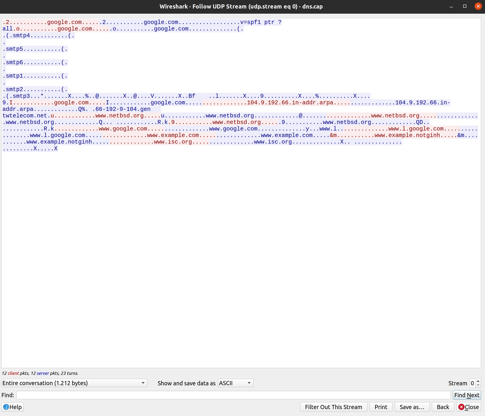
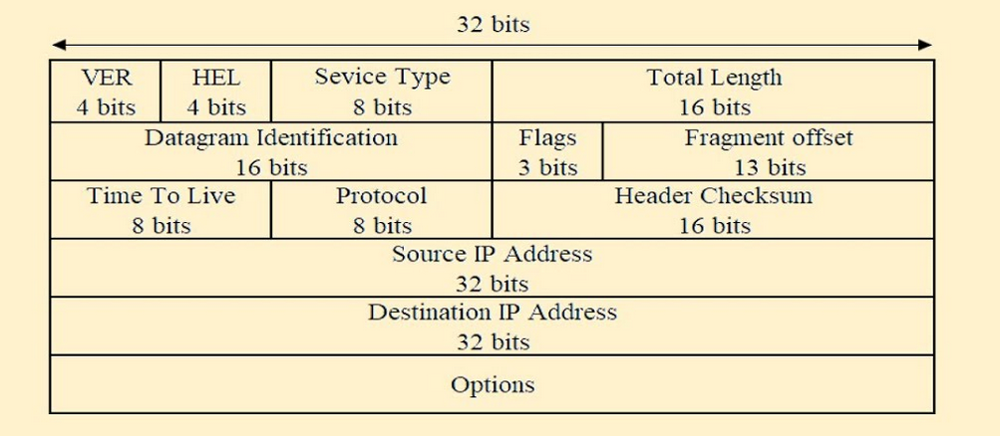

# Analisis Telnet, DNS, dan HTTP
Analisis dalam dokumen ini menggunakan aplikasi Wireshark dan sampel tangkapan Wireshark yang dapat Anda unduh [di sini](https://wiki.wireshark.org/SampleCaptures).

### 1. Analisis Telnet
Telnet adalah sebuah protokol jaringan yang digunakan untuk mengakses dan mengendalikan perangkat dari jarak jauh melalui jaringan. Biasanya, Telnet digunakan untuk mengakses shell atau lingkungan baris perintah pada perangkat jarak jauh seperti server, router, atau perangkat lain yang mendukung koneksi jaringan.

Dalam penggunaannya, Telnet memungkinkan pengguna untuk terhubung ke perangkat jarak jauh dan berinteraksi dengan sistem tersebut seolah-olah mereka berada di depan perangkat tersebut. Pengguna dapat memasukkan perintah, menjalankan program, dan melihat output dari perangkat jarak jauh ini melalui koneksi Telnet.

#### Contoh Wireshark dari protokol jaringan Telnet:

        

#### Analisis:
Dari sini, kita dapat mengetahui alamat IP pengguna (192.168.0.2) dan alamat IP server/PC yang diakses dari jarak jauh (192.168.0.1), serta port yang digunakan oleh pengguna (1550) dan server/PC yang diakses (23) menggunakan protokol TCP untuk layanan Telnet.

        

Di aplikasi Wireshark, kita dapat melihat aliran TCP atau apa yang terjadi dalam protokol TCP. Warna merah menunjukkan data yang dikirim oleh pengguna (yang mengakses server/PC jarak jauh), sementara warna biru menunjukkan balasan dari server/PC yang diakses.

### 2. Analisis DNS
DNS adalah singkatan dari "Domain Name System" (Sistem Nama Domain). Ini adalah sistem yang digunakan dalam jaringan komputer untuk mengubah nama domain yang mudah diingat (seperti www.contoh.com) menjadi alamat IP numerik yang diperlukan oleh komputer untuk berkomunikasi satu sama lain di internet. DNS memungkinkan manusia menggunakan nama domain yang mudah diingat saat mengakses situs web atau layanan online, sementara komputer menggunakan alamat IP untuk mengidentifikasi dan berkomunikasi dengan server yang tepat.

#### Contoh Wireshark dari DNS:

        

#### Analisis:
Dari data di atas, kita dapat mengetahui alamat IP internet dari client dan server (client: 192.168.170.8, server: 192.168.170.20) serta port yang digunakan oleh client (32795) dan server (53).

        

Sama seperti Telnet, dalam analisis aliran UDP, kita dapat melihat apa yang terjadi pada sisi client (warna merah) dan sisi server (warna biru).

### 3. Analisis HTTP
HTTP adalah singkatan dari "Hypertext Transfer Protocol" (Protokol Transfer Hiperteks). Ini adalah protokol yang digunakan untuk mengirimkan data antara klien (seperti peramban web) dan server di World Wide Web. HTTP mengatur cara permintaan dan respons data, terutama dalam konteks halaman web, tetapi juga digunakan dalam berbagai aplikasi berbasis web.

#### Contoh Wireshark dari HTTP:

        

#### Analisis:
Dari Wireshark ini, kita dapat mengetahui alamat IP client dan server, serta port yang digunakan, seperti pada analisis sebelumnya.

IP client: 145.254.160.237

IP Server: 65.208.228.223

Kita juga dapat melihat bahwa ada proses enkoding data, seperti gambar XML dan lainnya.

        

Header dari client dikirim (warna merah) dan diterima oleh server (warna biru). Status "HTTP/1.200 OK" menunjukkan bahwa permintaan berhasil, dan halaman web ditampilkan.

## Header TCP

        

Header TCP (Transmission Control Protocol) adalah bagian dari struktur data yang digunakan untuk mengemas dan mengirimkan data melalui koneksi TCP dalam jaringan komputer. TCP adalah protokol yang berorientasi pada koneksi dan dapat diandalkan, memastikan pengiriman data yang akurat, terurut, dan tanpa kerusakan antara pengirim dan penerima. Berikut adalah beberapa bidang utama yang ada dalam header TCP:

1. Port Sumber (Source Port): Ini adalah nomor port yang mengidentifikasi proses pengirim data di komputer pengirim.

2. Port Tujuan (Destination Port): Ini adalah nomor port yang mengidentifikasi proses penerima data di komputer penerima.

3. Nomor Sekuens (Sequence Number): Nomor ini mengidentifikasi urutan data dalam aliran. Setiap

 byte dalam aliran data memiliki nomor urut yang unik.

4. Nomor Konfirmasi (Acknowledgment Number): Nomor ini menunjukkan nomor urut dari byte berikutnya yang diharapkan diterima oleh pengirim. Ini digunakan dalam mekanisme pengakuan dan konfirmasi TCP.

5. Ukuran Header (Header Length): Ini menunjukkan panjang header TCP dalam kata (4-byte). Karena header TCP dapat mengandung opsi yang bervariasi dalam ukuran, nilai ini membantu untuk mengetahui di mana data aktual dimulai dalam segmen.

6. Flag Kontrol (Control Flags): Ini adalah serangkaian bit yang mengontrol perilaku koneksi TCP. Beberapa flag penting termasuk:
        
        URG (Urgent): Menandakan adanya data penting dalam segmen yang memerlukan penanganan segera.
        ACK (Acknowledgment): Menunjukkan bahwa nomor konfirmasi valid dalam segmen.
        PSH (Push): Meminta penerima untuk segera meneruskan data ke aplikasi penerima.
        RST (Reset): Digunakan untuk menghentikan koneksi secara tiba-tiba dan mengatur ulang koneksi.
        SYN (Synchronize): Menandakan permintaan koneksi atau inisialisasi koneksi.
        FIN (Finish): Menandakan bahwa pengirim telah selesai mengirim data dan ingin menutup koneksi.

7. Ukuran Jendela (Window Size): Ukuran jendela mengindikasikan berapa banyak data yang dapat diterima oleh penerima sebelum pengirim perlu menunggu pengakuan.

8. Checksum: Checksum adalah nilai yang dihitung dari header dan data TCP untuk mendeteksi kesalahan selama transmisi.

9. Pilihan (Options): Header TCP dapat mengandung opsi tambahan yang dapat digunakan untuk mengatur perilaku dan mengaktifkan fitur-fitur khusus, seperti penyesuaian ukuran jendela dan mekanisme pengiriman ulang yang lebih canggih.

10. Pointer Darurat (Urgent Pointer): Digunakan bersama dengan flag URG untuk menunjukkan posisi data yang mendesak dalam aliran.

Header TCP memainkan peran penting dalam mengatur komunikasi antara komputer pengirim dan penerima melalui koneksi TCP. Setiap bidang dalam header memiliki fungsi spesifik yang membantu memastikan pengiriman data yang akurat dan andal di seluruh jaringan.

## Header UDP

        

Header UDP (User Datagram Protocol) adalah bagian dari struktur data yang digunakan untuk mengemas dan mengirimkan data dalam koneksi UDP dalam jaringan komputer. UDP adalah protokol tanpa koneksi yang lebih sederhana daripada TCP, yang berarti tidak ada pengiriman ulang atau mekanisme pengakuan. Ini membuat UDP lebih cepat, tetapi juga lebih tidak andal dibandingkan dengan TCP. Berikut adalah beberapa bidang utama yang ada dalam header UDP:

1. Port Sumber (Source Port): Ini adalah nomor port yang mengidentifikasi proses pengirim data di komputer pengirim.

2. Port Tujuan (Destination Port): Ini adalah nomor port yang mengidentifikasi proses penerima data di komputer penerima.

3. Panjang UDP (Length): Panjang ini mencakup ukuran total dari header UDP dan data yang diikutsertakan dalam segmen UDP. Ini diukur dalam byte.

4. Checksum: Checksum digunakan untuk mendeteksi kesalahan pada data selama transmisi. Namun, dalam UDP, penggunaan checksum adalah opsional dan dapat diabaikan jika checksum diatur sebagai nol.

Header UDP cukup sederhana dan tidak mengandung banyak informasi tambahan seperti header TCP. Oleh karena itu, UDP lebih cepat dan memiliki overhead yang lebih rendah daripada TCP. Namun, karena kurangnya mekanisme pengiriman ulang dan pengakuan, UDP tidak cocok untuk aplikasi yang memerlukan pengiriman data yang andal, seperti transfer file atau streaming video. Sebaliknya, UDP lebih cocok untuk aplikasi yang lebih responsif dan dapat mengatasi kerugian data yang kecil, seperti aplikasi suara atau video real-time.

## Header IP

        

Header IP (Internet Protocol) adalah bagian dari struktur data yang digunakan untuk mengemas dan mengarahkan paket data dalam jaringan komputer. IP adalah protokol yang mendasari jaringan internet, dan bertanggung jawab untuk mengirimkan paket data dari sumber ke tujuan melalui jaringan yang mungkin terdiri dari beberapa perangkat dan rute. Berikut adalah beberapa bidang utama yang ada dalam header IP:

1. Versi (Version): Ini menunjukkan versi protokol IP yang digunakan. Dalam header IP, nilai ini dapat berupa 4 untuk IPv4 atau 6 untuk IPv6.

2. Panjang Header (Header Length): Panjang header IP diukur dalam kata (32-bit). Karena header IP dapat mengandung opsi yang bervariasi dalam ukuran, nilai ini membantu untuk mengetahui di mana data aktual dimulai dalam paket.

3. Tipe Layanan (Type of Service): Ini dulu digunakan untuk menandakan prioritas paket atau layanan yang diinginkan, tetapi sekarang lebih sering digunakan untuk mengindikasikan pengelompokan dan penanganan khusus oleh perangkat jaringan.

4. Panjang Total (Total Length): Ini adalah ukuran total paket IP, termasuk header dan data, diukur dalam byte.

5. Identifikasi (Identification): Nilai ini adalah nomor unik yang mengidentifikasi paket. Digunakan bersama dengan flag "Fragmentation" untuk mengatur ulang paket yang pecah-pecah.

6. Flag dan Fragment Offset: Digunakan dalam proses fragmentasi paket, yang memungkinkan paket besar untuk dipecah menjadi bagian yang lebih kecil saat melintasi jaringan dengan batasan ukuran maksimal. Flag ini mencakup "Don't Fragment" (DF) dan "More Fragments" (MF), sementara Fragment Offset menunjukkan posisi data dalam fragmen.

7. Time to Live (TTL): TTL menunjukkan berapa banyak langkah (hops) yang dapat dilakukan oleh paket sebelum dihapus dari jaringan. Ini membantu mencegah paket terperangkap dalam loop tak terbatas.

8. Protokol: Nilai ini men

unjukkan protokol tingkat atas yang digunakan dalam paket. Sebagai contoh, nilai 6 menunjukkan bahwa paket berisi data TCP, sementara nilai 17 menunjukkan paket berisi data UDP.

9. Checksum Header (Header Checksum): Checksum digunakan untuk mendeteksi kesalahan dalam header IP selama perjalanan melalui jaringan.

10. Alamat IP Sumber (Source IP Address): Ini adalah alamat IP pengirim paket.

11. Alamat IP Tujuan (Destination IP Address): Ini adalah alamat IP penerima paket.

Header IP sangat penting dalam pengiriman paket data di seluruh internet. Ini mengandung informasi yang diperlukan untuk mengarahkan paket dari sumber ke tujuan melalui rute yang benar, dan juga membawa informasi tentang tipe layanan yang diinginkan oleh paket. Selain itu, header IP juga mencakup informasi yang digunakan dalam proses fragmentasi jika paket harus dipecah-pecah untuk melintasi jaringan dengan batasan ukuran maksimal.

## Apa itu PING?
PING adalah sebuah perintah yang digunakan dalam jaringan komputer untuk mengukur ketersediaan dan waktu respon dari sebuah host atau perangkat jaringan. Perintah PING mengirimkan paket data ke host atau perangkat tujuan dan kemudian mengukur berapa lama waktu yang dibutuhkan untuk paket tersebut untuk pergi ke tujuan dan kembali. Hasil pengukuran ini memberikan gambaran tentang seberapa cepat host atau perangkat tersebut merespons permintaan jaringan.

Beberapa informasi yang dapat diperoleh dari hasil perintah PING meliputi:

- **RTT (Round-Trip Time)**: Ini adalah waktu yang dibutuhkan oleh paket untuk pergi dari host pengirim ke host tujuan dan kembali. RTT mengukur latensi jaringan.

- **Packet Loss**: PING juga memberikan informasi tentang berapa banyak paket yang hilang selama perjalanan. Ini dapat digunakan untuk mengidentifikasi masalah jaringan, seperti koneksi yang tidak stabil.

- **Statistik**: PING sering menyediakan statistik yang mencakup jumlah paket yang dikirim, jumlah paket yang diterima, jumlah paket yang hilang, dan rata-rata RTT.

- **Alamat IP**: PING digunakan dengan menyertakan alamat IP atau nama host sebagai argumen perintah untuk menentukan host atau perangkat yang akan diuji.

PING adalah alat yang berguna dalam pemecahan masalah jaringan dan pengukuran performa jaringan. Ini digunakan untuk menguji konektivitas antara host, mengidentifikasi masalah jaringan, dan memantau kinerja jaringan.

## Apa itu Traceroute (trecert)?
Traceroute (dikenal sebagai "tracert" di lingkungan Windows) adalah alat yang digunakan untuk melacak rute yang diambil oleh paket data saat melakukan perjalanan melalui jaringan komputer. Ini membantu dalam mengidentifikasi semua perangkat jaringan yang dilewati oleh paket dari host sumber ke host tujuan. Traceroute mengukur waktu yang dibutuhkan oleh setiap hop dalam perjalanan paket dan dapat memberikan informasi tentang alasan mengapa paket mungkin mengalami keterlambatan atau kegagalan.

Beberapa informasi yang dapat diperoleh dari hasil perintah Traceroute meliputi:

- **Alamat IP Setiap Hop**: Traceroute menampilkan alamat IP dari setiap perangkat jaringan yang dilewati oleh paket saat melakukan perjalanan menuju tujuan. Ini memungkinkan Anda melihat rute sebenarnya yang diambil oleh paket.

- **Waktu yang Dibutuhkan Setiap Hop**: Traceroute mengukur waktu yang dibutuhkan oleh paket untuk mencapai setiap hop dalam perjalanan. Ini membantu dalam mengidentifikasi di mana mungkin terjadi penundaan atau masalah dalam rute.

- **Statistik dan Keterangan**: Traceroute sering menyediakan statistik yang mencakup jumlah hop total, waktu minimum, maksimum, dan rata-rata yang dibutuhkan untuk mencapai tujuan.

Traceroute adalah alat yang berguna untuk mengidentifikasi masalah jaringan, seperti hop yang lambat atau gagal, serta untuk memahami jalur yang diambil oleh paket saat melintasi internet. Ini membantu administrator jaringan dan pengguna untuk memecahkan masalah dan memahami performa jaringan dengan lebih baik.

Saya harap penjelasan ini memberikan pemahaman yang baik tentang analisis jaringan, header protokol, PING, dan Traceroute. Jika Anda memiliki pertanyaan lebih lanjut atau membutuhkan penjelasan tambahan tentang topik tertentu, silakan beri tahu saya.