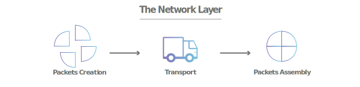

## OSI model layers
**Nama** : Dukhaan Kamimpangan  
**NRP** : 3122600003  
**Kelas** : 2 D4 IT A  
**Mata Kuliah** : Konsep Jaringan  

<strong>Gambar:</strong> 1.1 physical layer

- Lapisan terbawah dalam protokol komunikasi.

- Tugas utamanya adalah mengatur bagaimana data fisik (sinyal listrik, cahaya, atau radio) dikirimkan melalui kabel atau nirkabel.

- Contoh perangkat di lapisan ini adalah kabel jaringan dan antena Wi-Fi.

 

<strong>Gambar:</strong> 1.2 data link layer

- Lapisan ini bertanggung jawab atas pengiriman data dalam bentuk paket-paket.  

- Lapisan ini juga menangani deteksi dan perbaikan kesalahan dalam pengiriman data. 

- Disini, perangkat keras seperti kartu SIM hp dan switch beroperasi.

 

<strong>Gambar:</strong> 1.3 network layer

- Lapisan ini mengatur pengiriman data antara berbagai jaringan (misalnya, dari rumah ke internet).  

- Disini Protokol IP (Internet Protocol) beroperasi dan memberikan alamat unik pada setiap perangkat dalam jaringan.

 

<strong>Gambar:</strong> 1.4 network layer

- Lapisan ini memastikan data terkirim dengan benar dan dalam urutan yang tepat. 
 
- Protokol TCP (Transmission Control Protocol) di lapisan ini sangat penting, seperti mengatur komunikasi (pembicaraan) antara perangkat pengirim dan penerima.

 

<strong>Gambar:</strong> 1.5 session layer

- Lapisan ini mengatur dan mempertahankan sesi komunikasi antara perangkat.  

- Ini memungkinkan perangkat untuk memulai, menghentikan, dan mengelola percakapan.

 

<strong>Gambar:</strong> 1.6 presentation layer

- Lapisan ini bertanggung jawab untuk mengonversi data agar bisa dimengerti oleh perangkat yang berbeda.  

- Misalnya, mengubah teks, gambar, atau suara menjadi format yang bisa dipahami oleh perangkat lain.

 

<strong>Gambar:</strong> 1.7 presentation layer

- Lapisan paling atas dalam protokol komunikasi.  

- Ini adalah tempat aplikasi dan layanan berjalan, seperti peramban web, email, dan pesan teks.  

- Lapisan ini memungkinkan pengguna untuk berinteraksi dengan jaringan dan layanan.

