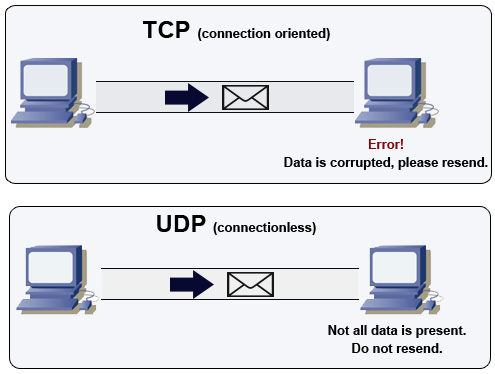

PERTANYAAN :
*1. Jelaskan kenapa 1 port ftp bisa memakai udp/tcp 

<strong>Gambar:</strong> 1.1 TCP & UDP

1. **FTP (File Transfer Protocol) dan Penggunaan UDP/TCP:**
   
   FTP adalah protokol yang digunakan untuk mentransfer file antara komputer. Protokol ini umumnya menggunakan TCP (Transmission Control Protocol) sebagai dasar komunikasi, bukan UDP (User Datagram Protocol). Alasannya adalah karena FTP membutuhkan pengiriman data yang andal dan pasti. TCP menawarkan pengiriman data yang andal karena mengatur ulang dan memastikan data tiba dengan benar.

   Mengapa TCP dan bukan UDP?
   - **Keandalan**: TCP memastikan data yang dikirimkan sampai dengan aman, menghindari kehilangan data atau pengiriman data ganda.
   - **Pengaturan Ulang**: Jika ada kehilangan paket data di jalan, TCP akan mengatur ulang koneksi dan mengirim ulang data yang hilang, sehingga data yang dikirimkan tetap terjamin ketika tiba di tujuan.

    

   Sementara itu, UDP adalah protokol yang lebih cepat tetapi kurang andal dibandingkan dengan TCP. UDP tidak menjamin pengiriman data yang pasti dan tidak memiliki mekanisme pengaturan ulang otomatis. Oleh karena itu, penggunaan UDP dalam FTP sangat jarang dan biasanya terbatas pada situasi khusus yang memprioritaskan kecepatan di atas keandalan. Dalam implementasi standar, FTP menggunakan TCP untuk memastikan integritas dan keandalan data yang ditransfer.