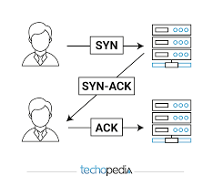

PERTANYAAN :
jelaskan tentang tentang three way handshaking

<strong>Gambar:</strong> 1.1 three ways handshake

**Three-Way Handshaking (Jabat Tangan Tiga Langkah):**

   Three-way handshaking adalah proses awal saat dua komputer ingin menjalin koneksi melalui TCP. Ini seperti berbicara satu sama lain sebelum memulai pertukaran data. Prosesnya terdiri dari tiga langkah, yang akan saya jelaskan dengan contoh:

   - **Langkah 1 (Permintaan Koneksi)**: 
      Klien memulai komunikasi dengan mengirimkan pesan khusus yang berisi tanda "SYN" ke server. Ini seperti mengatakan pada server, "Hai, saya ingin berbicara denganmu!"

   
      Contoh : Komputer A ingin berbicara dengan Komputer B, jadi A mengirimkan pesan ke B yang berisi permintaan untuk memulai koneksi. Misalnya, A mengatakan, "Halo, saya ingin berbicara denganmu."

   - **Langkah 2 (Persetujuan Koneksi)**: 
      Server menerima pesan dari klien dan merespons dengan pesan khusus yang berisi 
   
      Contoh : Jika Komputer B siap untuk berbicara dengan A, ia akan merespons permintaan tersebut dengan pesan persetujuan. Misalnya, B berkata, "Tentu, saya siap berbicara denganmu. Saya mendengarmu."

   - **Langkah 3 (Konfirmasi Koneksi)**: 
      Klien menerima pesan dari server dan merespons dengan pesan khusus yang berisi 
   
      Contoh : Sekarang, Komputer A harus memberi tahu Komputer B bahwa ia sudah mendengar persetujuan tersebut dan koneksi siap digunakan. Misalnya, A mengirim pesan kembali kepada B, "Saya juga mendengarmu dengan baik. Mari kita mulai berbicara."

   Setelah tiga langkah ini selesai, koneksi TCP antara dua komputer sudah dibuat dan mereka dapat mulai mengirim data dengan keyakinan bahwa koneksi ini berfungsi dengan baik.

Dengan three-way handshaking, koneksi TCP menjadi stabil dan dapat diawasi. Ini memastikan bahwa data yang dikirimkan akan sampai ke tujuan dengan benar dan tidak akan hilang di tengah jalan.